:imagesdir: img

to install the node, i recommend to go through here: https://github.com/nmzn/pluginnode-install 
its a one-click install with only some prompts to set your login credentials and keys. thats it.

# deployment-guide
This is my take on a guide to explain how to deploy the jobs and contracts to get a plugin node ready
Node Oracle Deployment Guide

First of all we need to install the Browser Plugin „XDCpay“. Create a Wallet and send some XDC and PLI there. 5 of each will be completly fine for you to get the idea.

```
After setting up the wallet,  we need to add an adress to it for the deployment to work.
```

**Step 1:**

Press on the Menu (1) to open the „Wallet Options“. Then press on „Settings“ (2) to see the following:
 
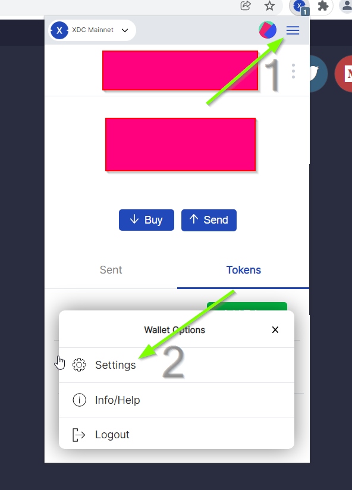
 
Enter the „New RPC URL“ ( https://erpc.xinfin.network/ ) and press „save“

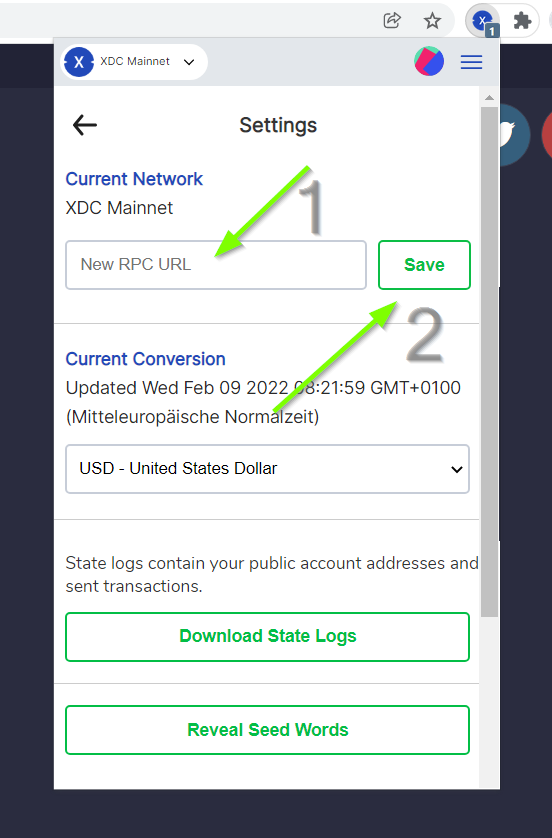

You should now see the following:
 
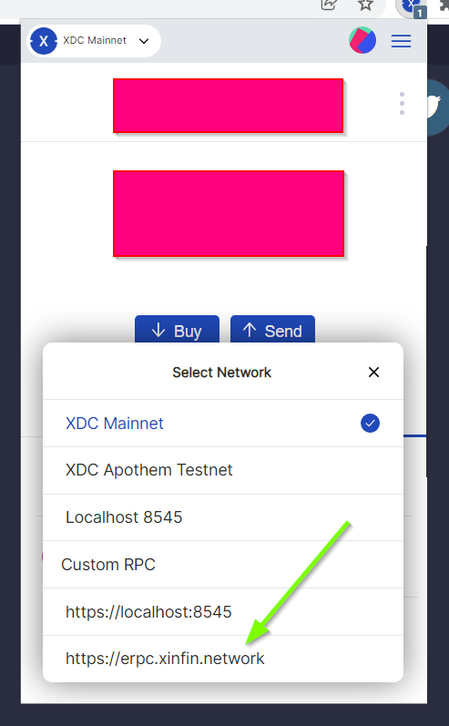

**Step 2:**

Open https://remix.xinfin.network/ in the same browser in which you have set up your XDCpay Wallet.

Open the „Oracle.sol“ as shown below. If it´s not there for you, just create a new file with this name. Thats just as fine.

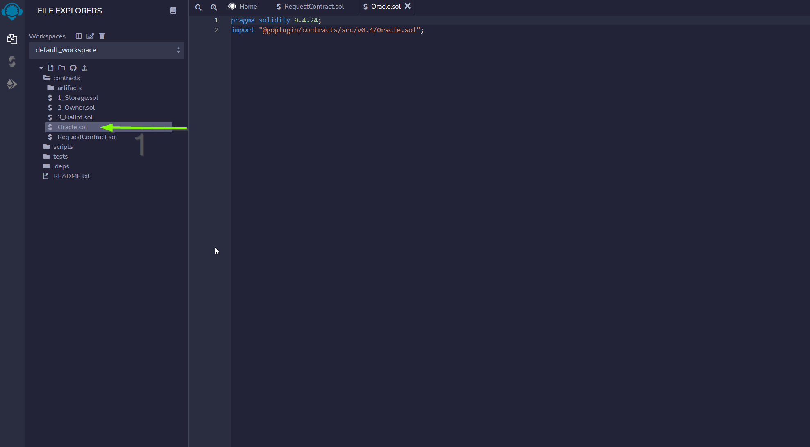

Paste the following code snippet into the fresh file or check the content to appear as shown below:
Code:

    pragma solidity 0.4.24;
    import "@goplugin/contracts/src/v0.4/Oracle.sol";

**Step 3:**

First get into the „Solidity Compiler“ (1)
Check if the compiler (2) has the same version as shown in the code (3).
 
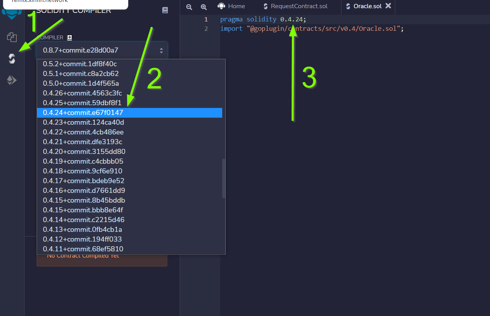

Click „Compile Oracle.sol“ (1) and see that the logo shows a green checkmark (2)
  
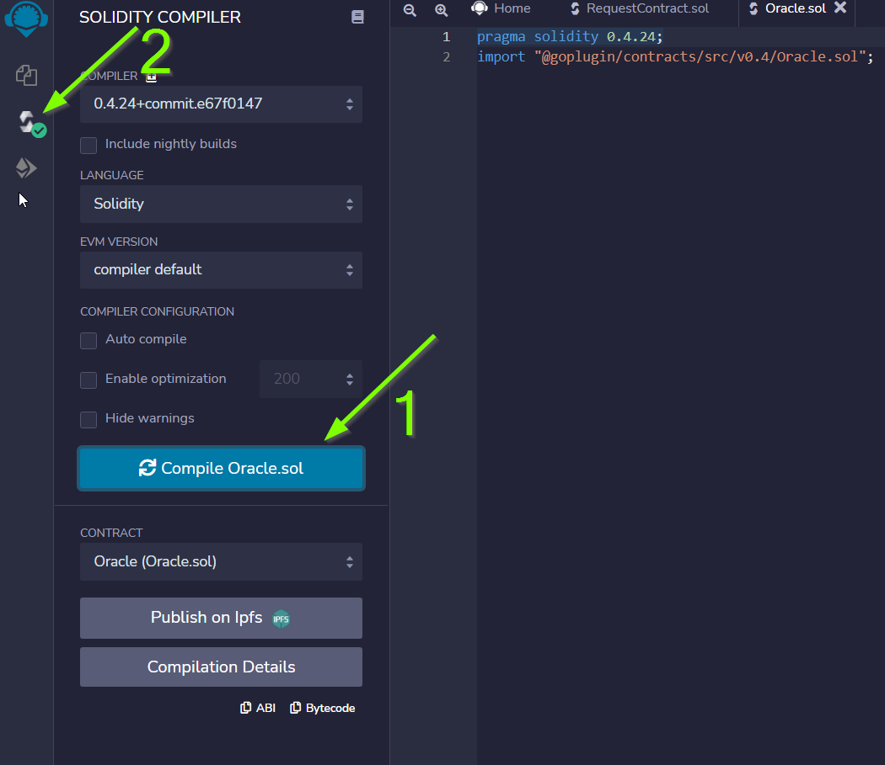

**Step 4:**

Click onto the „Deploy & run transactions“ (1) button.
Check that enviroment is „Injected Web3“ (2)
Check that your wallet adress is shown (3)
Paste the PLI Smart Contract ( 0xff7412ea7c8445c46a8254dfb557ac1e48094391 ) adress into the „Deploy“ form (4)
Press „Deploy“ (5)
 
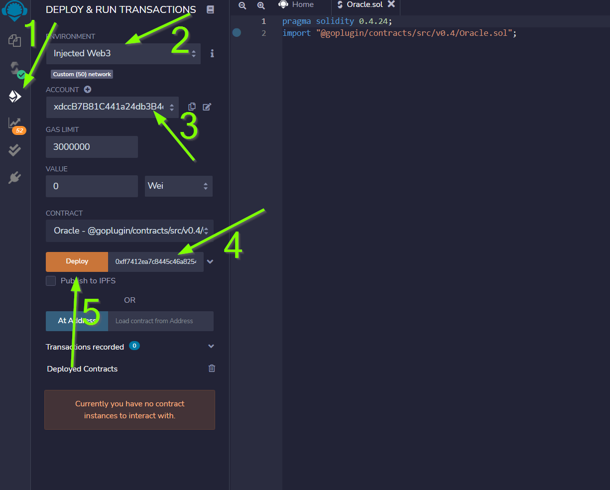

You are asked to confirm a transaction. Feel free to press „Submit“
 
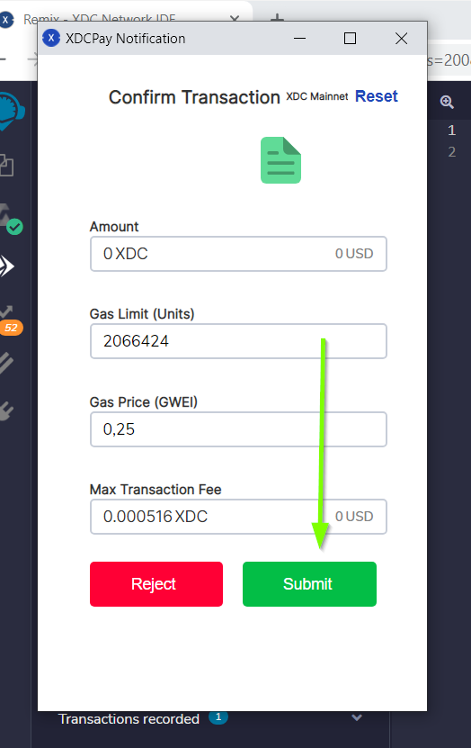

After submitting the transaction you should see this:

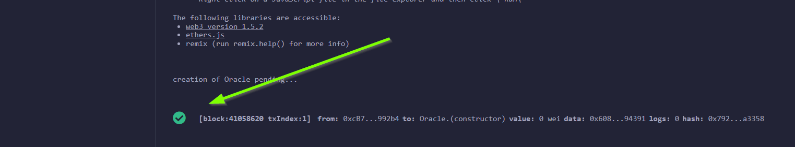

In the output part the bottom of your webbrowser.
(If not, make sure you have selected the https://erpc.xinfin.network/ node in you wallet)

Now click on the output (1) and copy your transaction hash (2)
 
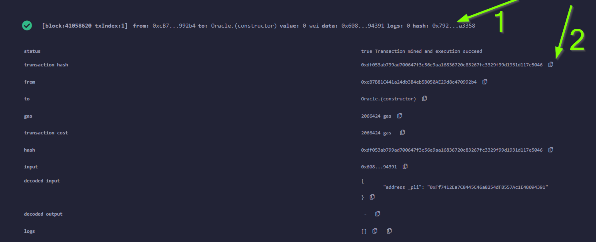

Go to https://explorer.xinfin.network/ (1)

And paste the tx-hash into the searchbox (2). Then click on the „search“ button (3).

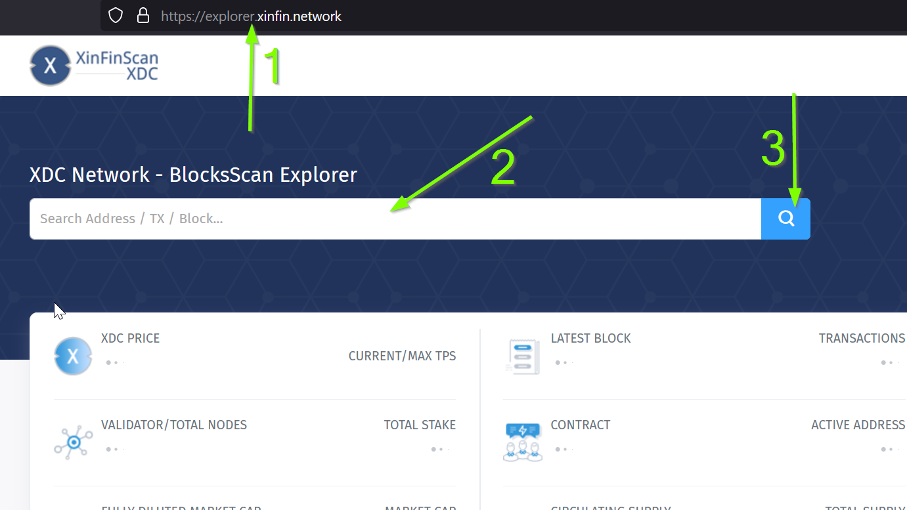

You`re now directed to a detailed overview regarding the transaction. Here you can see the Contract that has been created. Copy and store it somewhere because you need it later and for submitting the node when you´re finished.

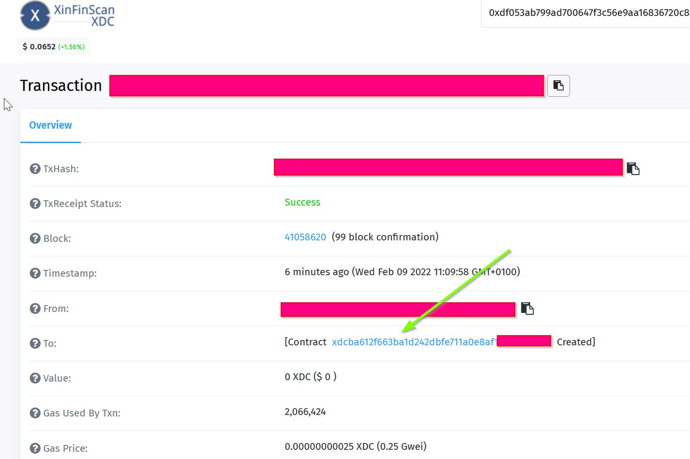


**Step 5:**


Log into your nodes dashboard. You´ll get there by typing http://your-ip:6688/ into your browser. If you have any problems getting there, make sure youre firewall on the servers allows the port 6688 ingoing. If it is not enabled, check log files and status of your node.
You can do that by using the following commands on the vps shell:
! „plinode“ is the name of my docker container. It may varies to yours. Maybe you even have no name for your container. You can check the name or ID of your container with the following command: 
  docker ps -a
  sudo docker exec -it plinode /bin/bash -c ". ~/.profile && pm2 status"
  sudo docker exec -it plinode /bin/bash -c ". ~/.profile && pm2 log 0" or 1 depending on which logs you want to access.
If you installed the node via script, you just need to use the following command:
  pm2 status
  pm2 logs 0/1

If you made it to the dashboard of your node, you`re looking at this:
Click on „Keys“
 
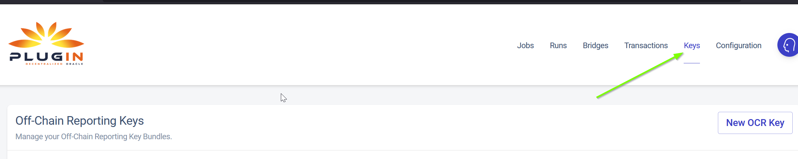

The top adress is the „Node Wallet Adress“ (1) you´ll also need later when submitting the node. Store it somewhere to get back to fast.
Click on the button to copy the adress (2) because you need to fund the node now with 1 xdc and 1 pli in order to allow the node to send transactions and pay the fee for it. Right now the Balance is 0 (3).
 
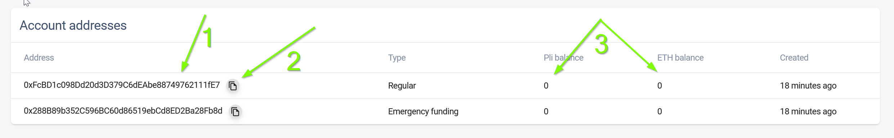

Open the XDCpay Wallet and press on „send“. Just send 1 xdc for now. 
 
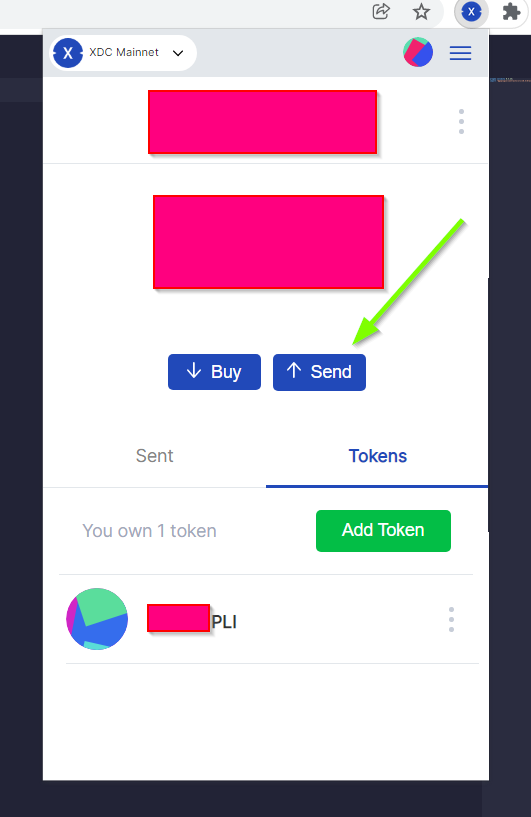

Next chose „Tokens“ (1) from the bottom list and then press on the Menu (2) 
 
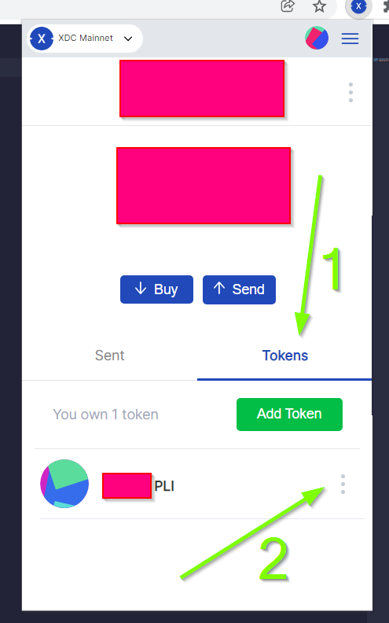
 
And „send“ on the next window.
 
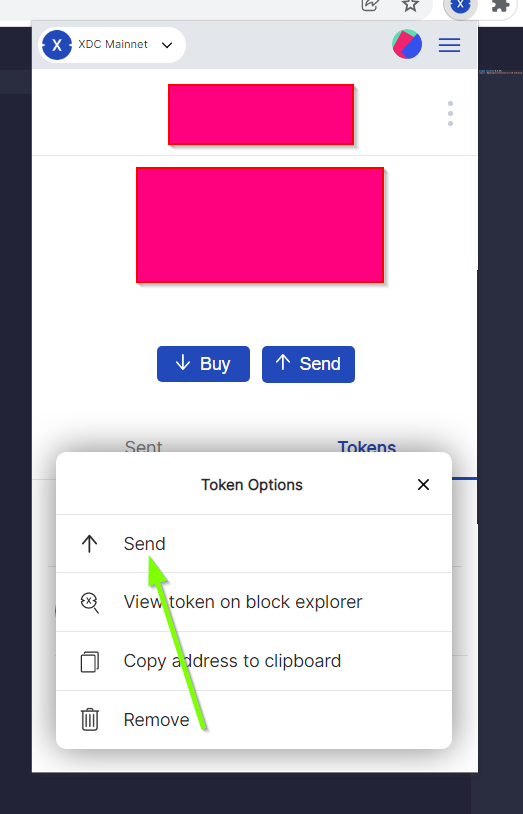

After you successfully sent 1 xdc and 1 pli you should now see the balance on your node:

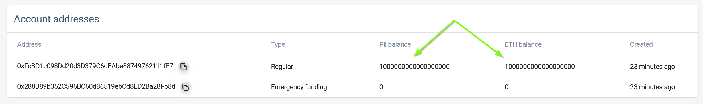

**Step 6:**

Get back to your browser and click on the dropdown button to validate your node on the blockchain.
 
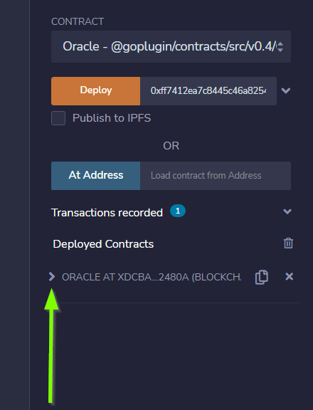

In the „setFulfillment…“ Form you paste your nodes wallet adress in the following form: „adress“,true (1). Then Press the button (2)
 
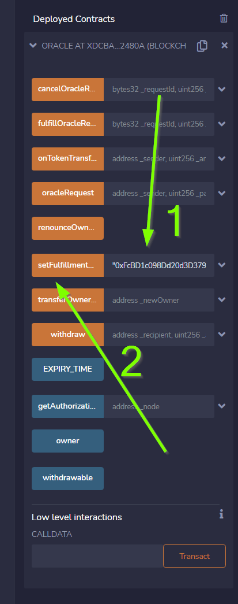

Once again you´re asked to confirm a transaction which you should do in order to proceed.
 
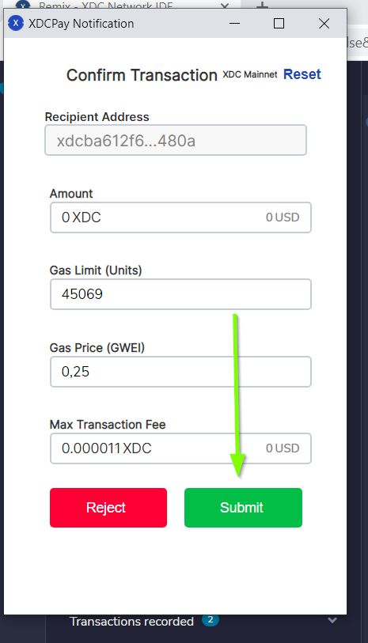

Confirmation of a successfull transaction is shown on the bottom again.
 
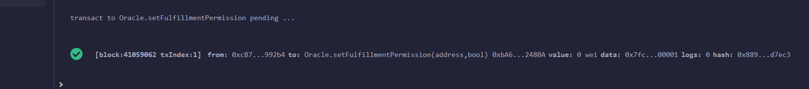

**Step 7:**

Next thing we need to do is to deploy a test job. In this case a simply Alarm Clock job.

First we alter this code:

    {
        "initiators":[
            {
               "type":"external",
               "params":{
         "name": "xdc",
                  "body": {
         "endpoint": "xdc",
         "addresses": ["0xf180e56bb575806aefaf2a7616622a9fc180b51c"]
        }
               }
           }
       ],
       "tasks":[
           {
               "type":"sleep",
               "confirmations":null,
               "params":{
                }
            },
            {
                "type":"ethbool",
                "confirmations":null,
                "params":{
                }
            },
            {
                "type":"ethtx",
                "confirmations":null,
                "params":{
                }
            }
        ],
        "startAt":null,
        "endAt":null
    }

 
Like this:
Name (1) and endpoint (2) need to be the same (for docker installations, and how you named it. In my example it is „pluginei“)
„Adresses“: (3) needs to be the oracle adress you received in Step 4. 
 
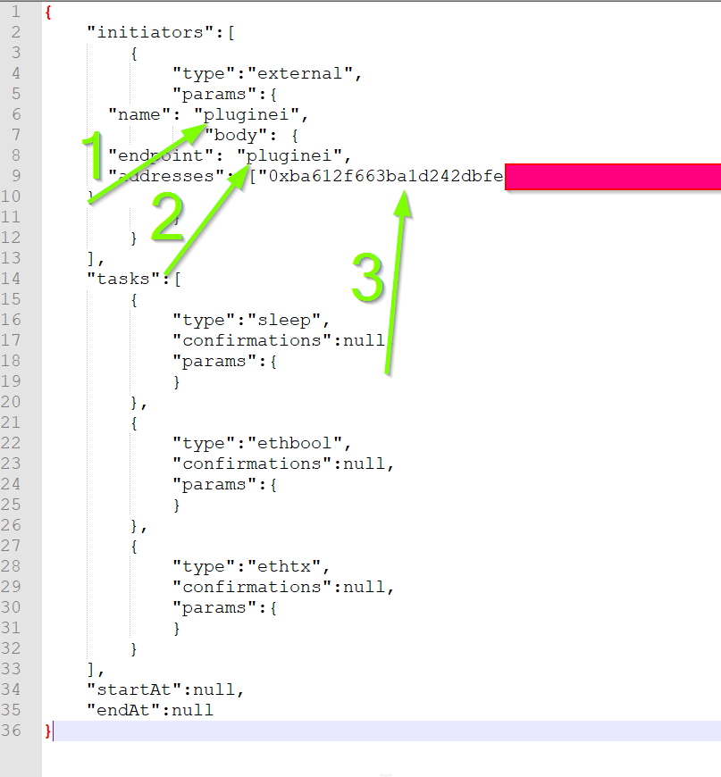

Go to your nodes dashboard and click on „Jobs“ (1) and then on „New Job“ (2) 

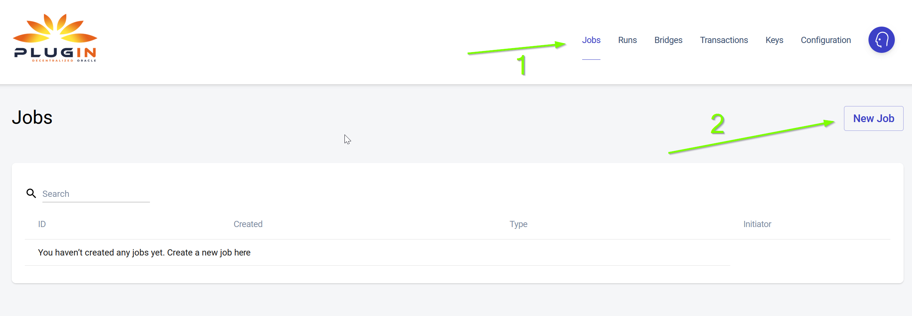

Paste your edited code:

image::Step25png[Step25]

Hit „Create Job“ when youre ready.

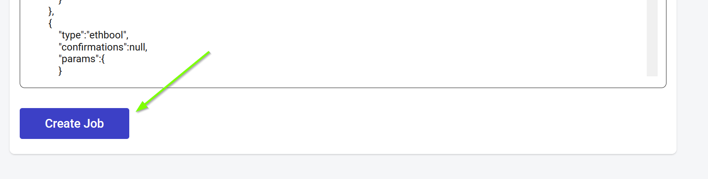
 
If everything is fine, you should see this:

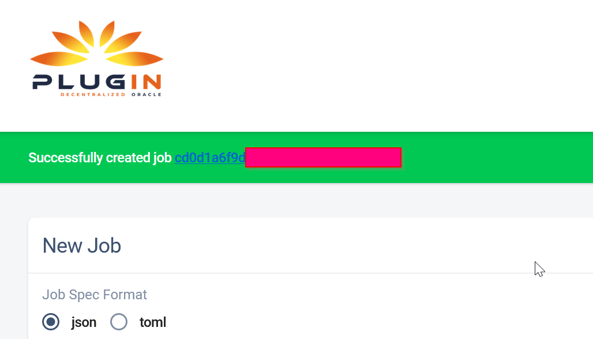

Next click on „Definition“ (1) and copy the Job ID like shown below (2).

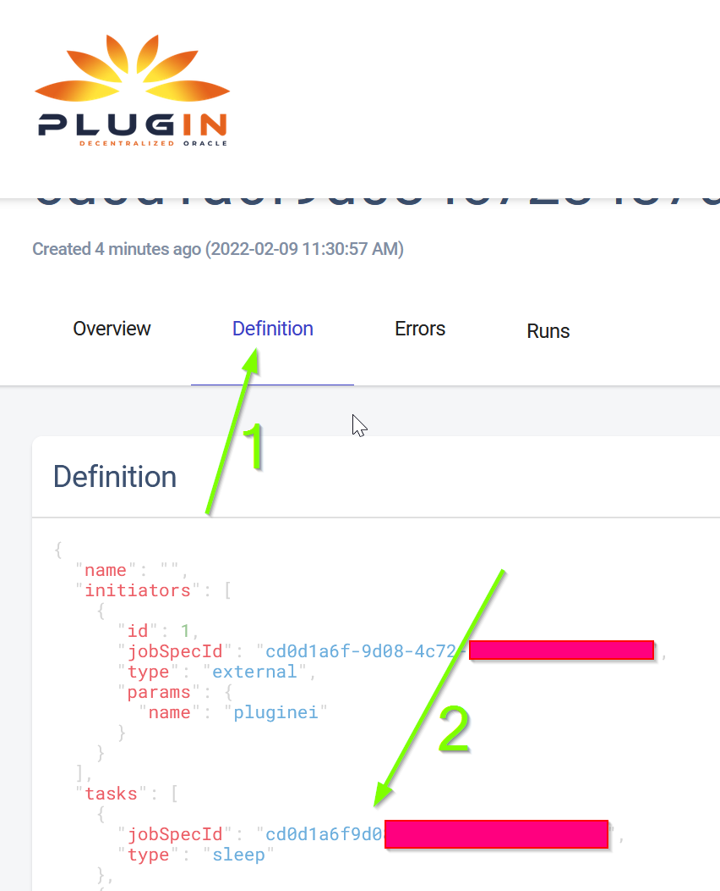

 
Step 8:
Go back to your browser (remix.xinfin.network)
Click on the „RequestContract.sol“ file. If there is none. Just create it yourself.
 
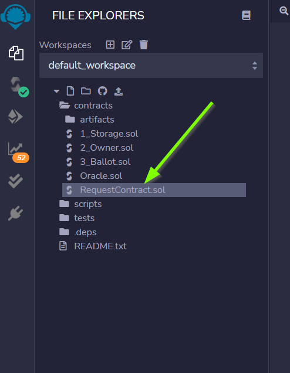
 
Here we need to paste the following code:

  // SPDX-License-Identifier: MIT
  pragma solidity ^0.4.24;
  import "https://github.com/GoPlugin/contracts/blob/main/src/v0.4/PluginClient.sol";
  import "https://github.com/GoPlugin/contracts/blob/main/src/v0.4/vendor/Ownable.sol";
  contract AlarmClockSample is PluginClient,Ownable {
      using Plugin for Plugin.Request;
    
      bool public alarmDone;
      address private oracle;
      bytes32 private jobId;
      uint256 private fee;
      
      /**
       * Network: Mainnet
       * Oracle: Plugin - 0xf180e56bb575806aefaf2a7616622a9fc180b51c
       * Job ID: Plugin - bcbac9232272445294102fdd1ee97c98
       * Fee: 0.1 PLI
       */
      constructor(address _pli) public Ownable() {
          setPluginToken(_pli);
          oracle = 0xFcBD1c098Dd20d3D379C6dEAbe88749762111fE7;
          jobId = "cd0d1a6f9d084c728487d2ff1c266e5f";
          fee = 0.1 * 10 ** 18; // 0.1 PLI
          alarmDone = false;
      }
      
      /**
       * Create a Plugin request to start an alarm and after
       * the time in seconds is up, return throught the fulfillAlarm
       * function
       */
      function requestAlarmClock(uint256 durationInSeconds) public returns (bytes32 requestId) 
      {
          Plugin.Request memory request = buildPluginRequest(jobId, address(this), this.fulfillAlarm.selector);
          // This will return in 90 seconds
          request.addUint("until", block.timestamp + durationInSeconds);
          return sendPluginRequestTo(oracle, request, fee);
      }
      
      /**
       * Receive the response in the form of uint256
       */ 
      function fulfillAlarm(bytes32 _requestId, uint256 _volume) public recordPluginFulfillment(_requestId)
      {
          alarmDone = true;
      }
  function withdrawPli() public onlyOwner() { 
          PliTokenInterface pliToken = PliTokenInterface(pluginTokenAddress());
          require(pliToken.transfer(msg.sender, pliToken.balanceOf(address(this))), "Unable to transfer");
      }
  }
 
Edit it, so that it looks like this:
In oracle=YOURCONTRACTADRESS, paste yours (1)
Same goes for jobId=YOURJOBID. Its the ID we just got from creating the AlarmClock Job.

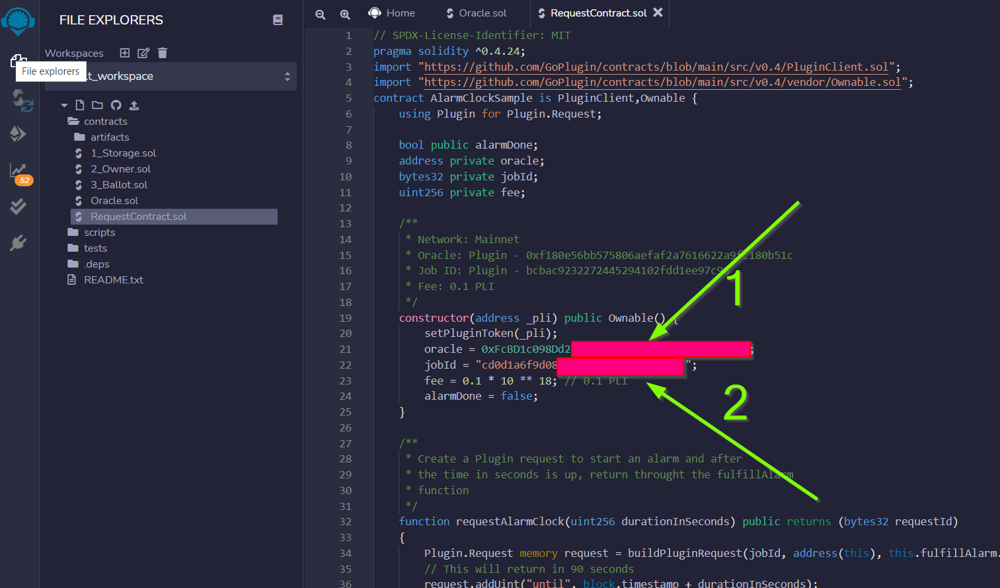

This will create the AlarmClock Contract. So that the job can get triggered.

After checking and editing the code you can hit the „Compile RequestContract.sol“ button. Please check the Compiler Version the same way you did for the „Oracle.sol“

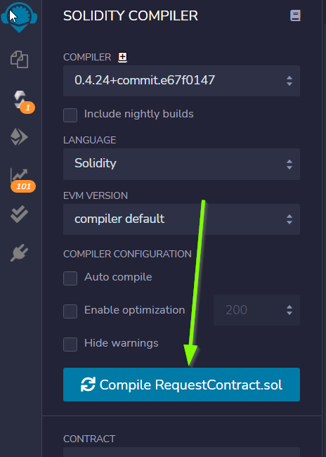

On the „Deploy & Run Transactions“ Tab you check for „Enviroment“ to be „Injected Web3“ (1), Account to be your Wallet adress (2), that your AlarmClockSample is selected as „Contract“ (3) and that you put the PLI Smart Contract Adress ( 0xff7412ea7c8445c46a8254dfb557ac1e48094391 ) into the „Deploy“button Form (4).
 
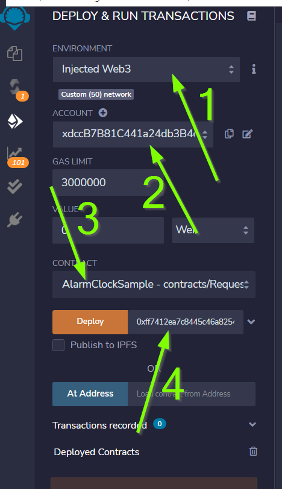
 
Hit „Deploy“ and confirm the transaction with „submit“.
 
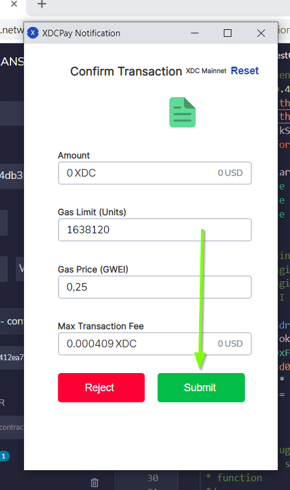

The output should show as the following:
 
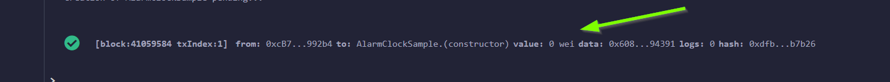
 
Now you need to copy the transaction hash again like before:
 
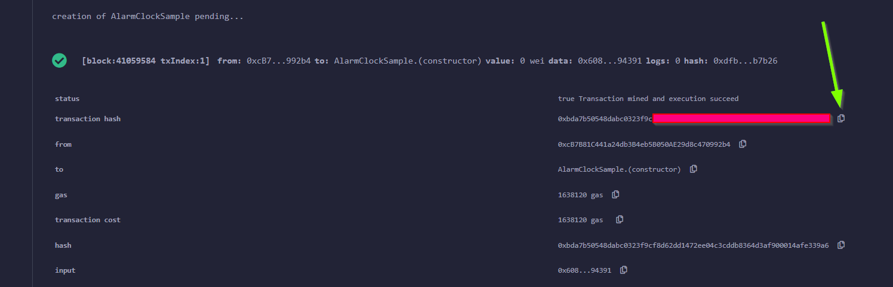

Go to https://explorer.xinfin.network , paste the hash and hit „search“.

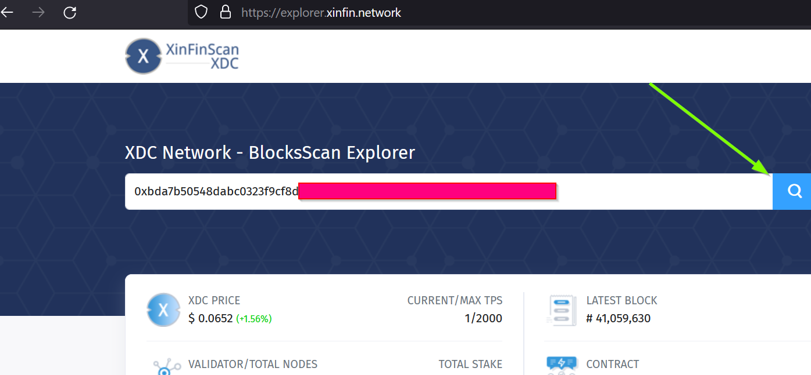
 
Copy the adress that got created:

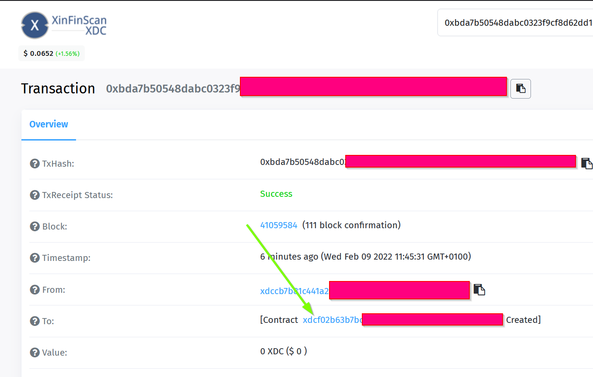
 
And fund it with 1 pli. We do that because now, the transaction gets triggered by the contract we just created. And to be able to make a transaction on the blockchain it needs to pay its fee.
Go to your wallet, select your pli token and send the token to the adress we just created.

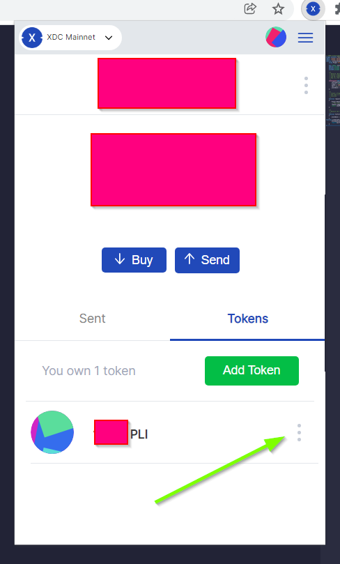

Make sure the right wallet is selected (1), the receipient ist he contract we just got from the xinfin explorer and you dont send more than 1 pli. Less would also be ok, but we want to be on the safe side for now (and with the current prices of 1 token)

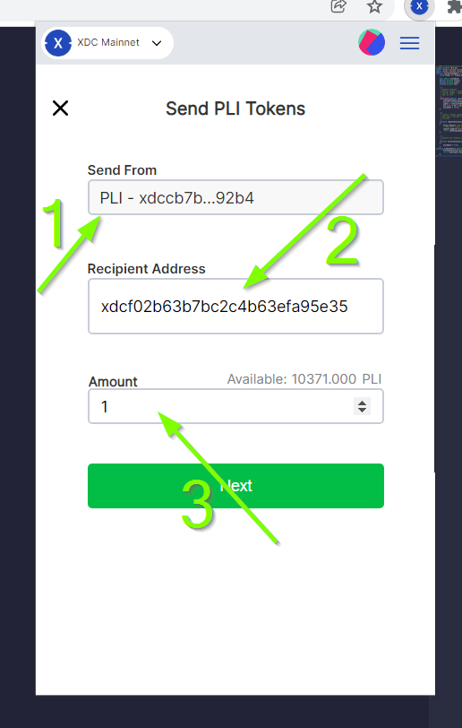
 
After the transaction is confirmed and submitted, click on the dropdown arrow fort he AlarmClockSample.
 
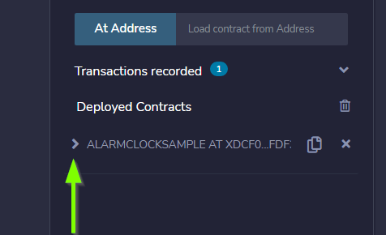

In the form for „requestAlarm“ put a „2“ (1) and hit the „requestAlarm…“ button (2).

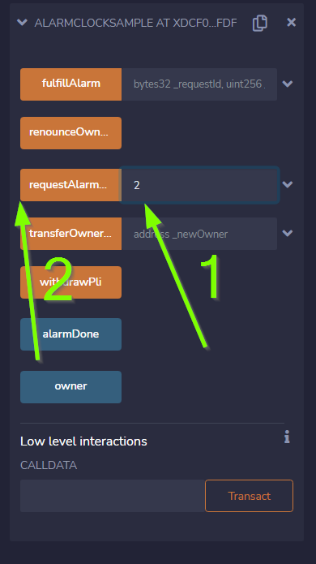

First of all the successfull transaction should be shown as output in your browser.


 
And you should be able to see the triggered job at your nodes dashboard under „Jobs“ and „Runs“.

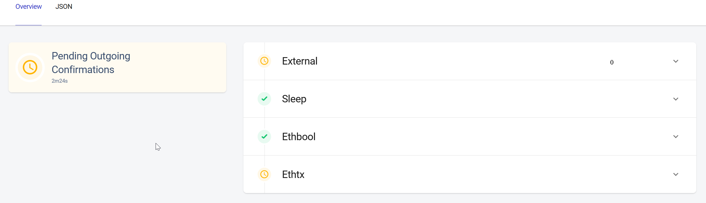

If you did everything accordingly, the result will be this:
 
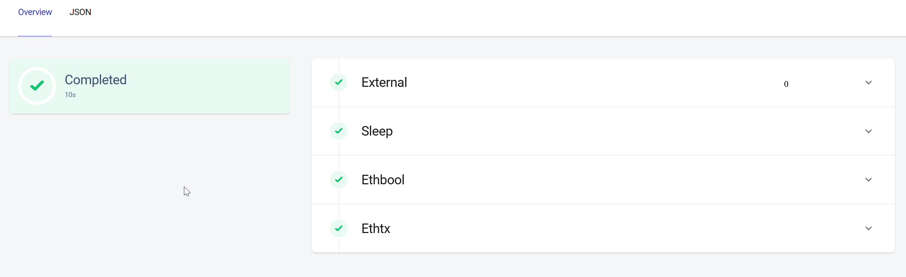

Thats it. You finished setting up the node. Its now ready to be submitted on your plugin dashboard which you can access via https://oracles.goplugin.co/

Congratulations!
